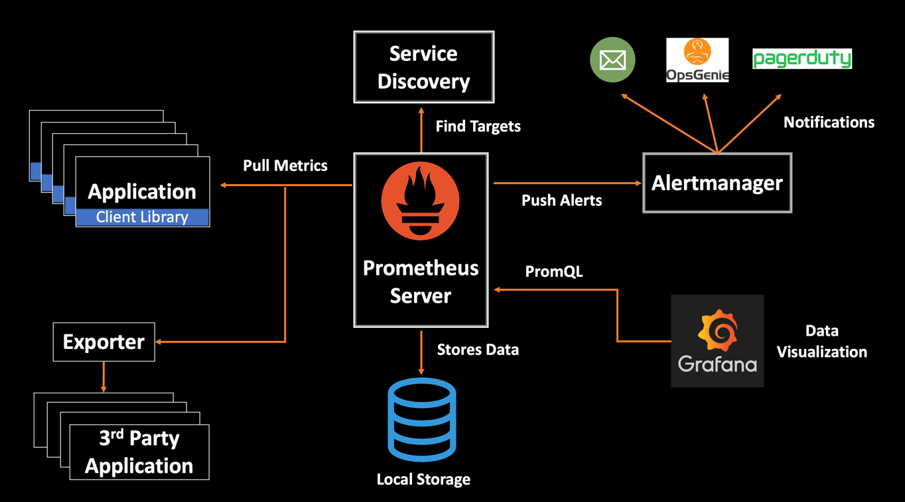

# Introduction au monitoring d'application

## Outils

Nous proposons d'utiliser Prometheus, Grafana et l'Alert Manager de Prometheus pour cette introduction :

    - Prometheus : collecte des métriques depuis l'application (dans nos exemples une application Flask)
    - Grafana : permet de visualiser les métriques et peut afficher des alertes
    - Alertmanager : gère les alertes relevées par Prometheus en fonction de règles pré-définies dans Prometheus

En amont, Prometheus peut recueillir des métriques de frameworks web (liste non exhaustive) :
* Python : Flask, Django, FastAPI,...
* Node.js
* Go
* Ruby
* PHP
* Java : Spring Boot, Quarkus, Vert.x

Et aussi monitorer :
* BDD : MySQL/MariaDB, PostgreSQL, Oracle, SQL Server, Redis, MongoDB, ElasticSearch, Cassandra...
* Docker / Kubernetes
* Azure / AWS / Google Cloud

Note : on peut aussi utiliser OpenTelemetry entre l'application et Prometheus pour collecter les métriques.

En aval, Prometheus peut alimenter des backends :
- de visualisation, comme Grafana, Kibana, Chronograph, Datadog...
- d'alertes, comme Alertmanager (intégré à Prometheus), Grafana OnCall, Zabbix, Nagios...
- de stockage de données (pour conserver les métriques), comme TSDB (intégré à Prometheus), Thanos, Cortex, ElasticSearch...
- d'interopérabilité, pour échanger avec d'autres systèmes, comme OpenMetrics, Prometheus Federation...

## Les métriques

Différentes catégories :
    Counter : A cumulative metric that only increases (e.g., total requests, errors).
    Gauge : A metric that can increase or decrease (e.g., current number of active users).
    Histogram : Used to measure the distribution of values (e.g., request latencies).
    Summary : Similar to Histogram but calculates quantiles (e.g., 95th percentile latency).

Prometheus contient une très grande variété de métriques prédéfinies mais il est possible de lui fournir des métriques personalisées.
     

## Exemples

Différence entre prometheus_client et prometheus_flask_exporter :
* prometheus_client:

      - Bibliothèque python générique de Prometheus
      - De bas niveau
      - Permet de créer des métriques (compteurs, jauges, histogrammes et résumés) et de les rendre accessibles via un endpoint HTTP (/metrics en général)

* prometheus_flask_exporter:

      - Bibliothèque Prometheus de haut niveau dédiée à Flask
      - Fournit des métriques pré-configurées mais limitées à Flask
      - Expose automatiquement /metrics

Avec prometheus_flask_exporter
1. Flask seul (/sample-signals)
2. Flask + Gunicorn (/sample-signals-gunicorn)
3. Flask + Gunicorn + Alerter (/sample-signals-gunicorn-alerter)

Avec prometheus_client

4. Flask + Gunicorn (/prometheus-client-example)

   -> Démonstration de configuration de Prometheus et Grafana directement dans leur interface (data source / dashboard)

**Petit rendu :**
0. Votre propre code de monitoring venant de votre projet
1. Avec prometheus_flask_exporter
   1. Copier le répertoire de l'exemple 3
   2. Ajouter une nouvelle route ou modifier une route existante dans l'app pour qu'elle réponde aléatoirement avec un code 200 (OK), 500 (pas de réponse serveur) ou 404 (fichier non trouvé)
   3. Ajouter une ou plusieurs règles d'alertes pour comptabiliser les codes d'erreur
   4. Enrichir le dashboard grafana pour suivre les occurrences de codes d'erreur
2. Avec prometheus_client
   1. Copier le répertoire de l'exemple 4
   2. Créer une ou plusieurs métriques personnalisées dans l'appli flask à transmettre à Prometheus (s'aider des parties commentées et choisir un type de métrique parmi les 4 possibles)
   3. Créer un dashboard dans Grafana pour suivre ces métriques

   Note : "The generate_latest() function is a core utility provided by the prometheus_client library to help expose metrics in a format that Prometheus can consume."

**Ressources :**

Doc et exemple Prometheus :
   - https://prometheus.io/docs/introduction/first_steps/
   - https://github.com/warpnet/awesome-prometheus

Très bon blog sur flask_exporter :

https://blog.viktoradam.net/2020/05/11/prometheus-flask-exporter/

Créer un dashboard Grafana :
   - https://grafana.com/docs/grafana/latest/getting-started/build-first-dashboard/

Des collections d'alertes :
    - https://www.squadcast.com/blog/prometheus-sample-alert-rules#prometheus-sample-alert-rules
    - https://samber.github.io/awesome-prometheus-alerts/rules.html
