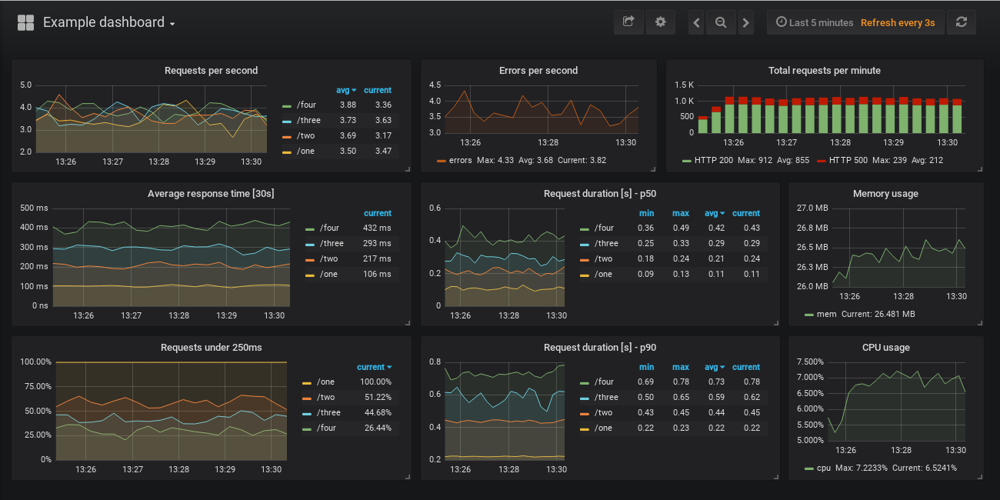

# Example dashboard



With this example, you can bring up a simple Flask application that has 4 endpoints, plus one that always returns an error response. The 4 main endpoints simply return `ok` after some random delay.

The example Compose project also includes a random load generator, a Prometheus server, and a Grafana instance with preconfigured dashboards, feeding data from Prometheus, which is also configured to scrape metrics from the example application automatically. All you need to do is:

```shell
docker-compose up -d
```

Then open <http://localhost:3000/d/_eX4mpl3> in your browser to see the dashboard. You can edit each panel to check what metric it uses, but here is a quick rundown of what's going on in there.

## Requests per second

Number of successful Flask requests per second. Shown per path.

```json
rate(
  flask_http_request_duration_seconds_count{status="200"}[30s]
)
```

## Errors per second

Number of failed (non HTTP 200) responses per second.

```json
sum(
  rate(
    flask_http_request_duration_seconds_count{status!="200"}[30s]
  )
)
```

## Total requests per minute

The total number of requests measured over one minute intervals. Shown per HTTP response status code.

```json
increase(
  flask_http_request_total[1m]
)
```

## Average response time [30s]

The average response time measured over 30 seconds intervals for successful requests. Shown per path.

```json
rate(
  flask_http_request_duration_seconds_sum{status="200"}[30s]
)
 /
rate(
  flask_http_request_duration_seconds_count{status="200"}[30s]
)
```

## Requests under 250ms

The percentage of successful requests finished within 1/4 second. Shown per path.

```json
increase(
  flask_http_request_duration_seconds_bucket{status="200",le="0.25"}[30s]
)
 / ignoring (le)
increase(
  flask_http_request_duration_seconds_count{status="200"}[30s]
)
```

## Request duration [s] - p50

The 50th percentile of request durations over the last 30 seconds. In other words, half of the requests finish in (min/max/avg) these times. Shown per path.

```json
histogram_quantile(
  0.5,
  rate(
    flask_http_request_duration_seconds_bucket{status="200"}[30s]
  )
)
```

## Request duration [s] - p90

The 90th percentile of request durations over the last 30 seconds. In other words, 90 percent of the requests finish in (min/max/avg) these times. Shown per path.

```json
histogram_quantile(
  0.9,
  rate(
    flask_http_request_duration_seconds_bucket{status="200"}[30s]
  )
)
```

## Memory usage

The memory usage of the Flask app. Based on data from the underlying Prometheus client library, not Flask specific.

```json
process_resident_memory_bytes{job="example"}
```

## CPU usage

The CPU usage of the Flask app as measured over 30 seconds intervals. Based on data from the underlying Prometheus client library, not Flask specific.

```json
rate(
  process_cpu_seconds_total{job="example"}[30s]
)
```

## Cleaning up

Don't forget to shut the demo down, once finished:

```shell
docker-compose down -v --rmi all
```
